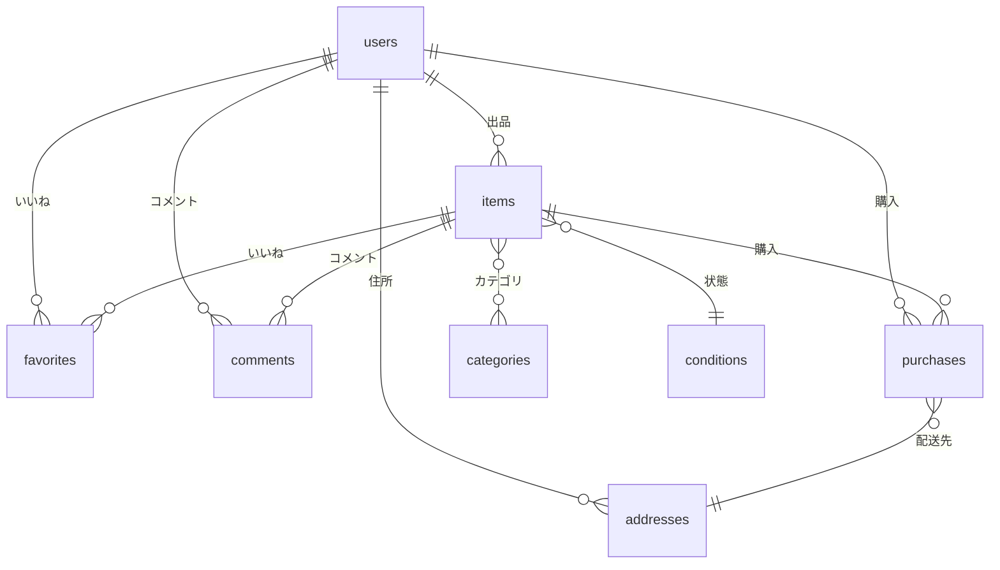

# コーチテックフリマ

## 環境構築

1. **リポジトリをクローン**
   ```bash
   git clone https://github.com/Akichq/bazaar.git
   cd bazaar
   ```

2. **Dockerイメージのビルド・起動**
   ```bash
   docker-compose build
   docker-compose up -d
   ```

3. **コンテナに入る**
   ```bash
   docker-compose exec app bash
   ```

4. **依存パッケージインストール**
   ```bash
   composer install
   ```

5. **.envファイルの作成・編集**
   ```bash
   cp .env.example .env
   # 必要に応じてDBやメール設定を編集
   ```

6. **アプリケーションキー発行**
   ```bash
   php artisan key:generate
   ```

7. **マイグレーション・シーディング**
   ```bash
   php artisan migrate --seed
   ```

8. **ストレージリンク作成**
   ```bash
   php artisan storage:link
   ```

---

## 使用技術

- PHP 7.4.9
- Laravel 8.83.8
- MySQL
- Docker
- Stripe（テスト決済用）
- Fortify（認証）

---

## 注意事項

- テストケースのID9について：
  - 「コメントが入力されていない場合、バリデーションメッセージが表示される」「コメントが255字以上の場合、バリデーションメッセージが表示される」のテスト内容と手順が逆になっていると思われます。
  - テスト自体はテストケース通りに記述しています。
- メール認証は事情により時間がなく実装できませんでした。

---

## ER図



---

## URL

- 開発環境: [http://localhost/](http://localhost/)
- phpMyAdmin    http://localhost:8080/

---

## 画面一覧

- 商品一覧画面（トップ画面）： `/`
- 商品一覧画面（トップ画面）_マイリスト： `/?page=mylist`
- 会員登録画面： `/register`
- ログイン画面： `/login`
- 商品詳細画面： `/item/:item_id`
- 商品購入画面： `/purchase/:item_id`
- 送付先住所変更画面： `/purchase/address/:item_id`
- 商品出品画面： `/sell`
- プロフィール画面： `/mypage`
- プロフィール編集画面（設定画面）： `/mypage/profile`
- プロフィール画面_購入した商品一覧： `/mypage?page=buy`
- プロフィール画面_出品した商品一覧： `/mypage?page=sell`
